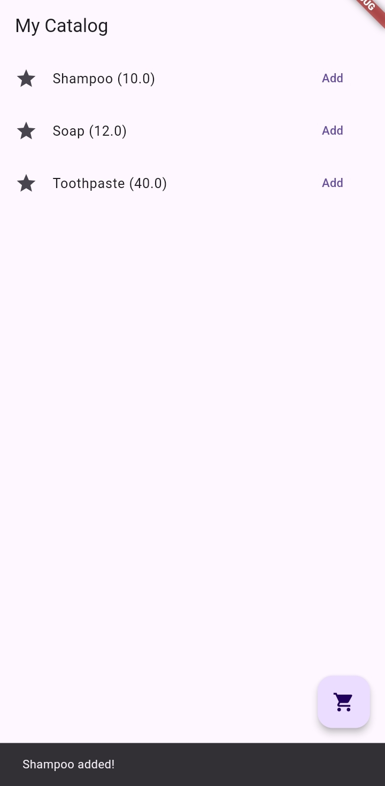
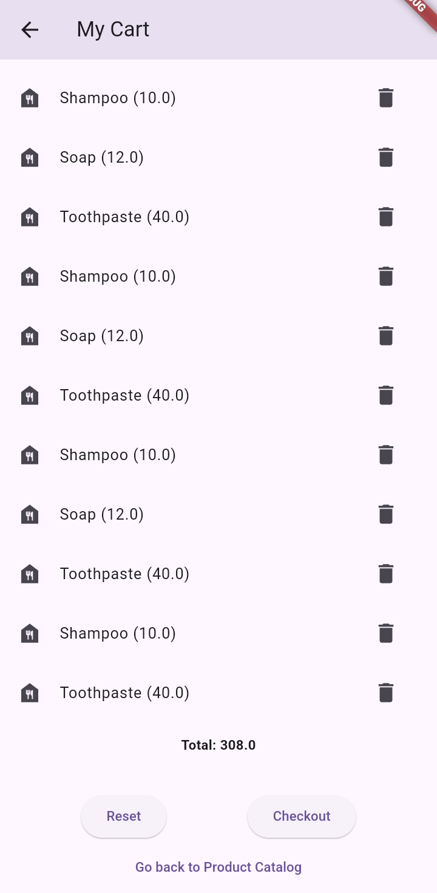
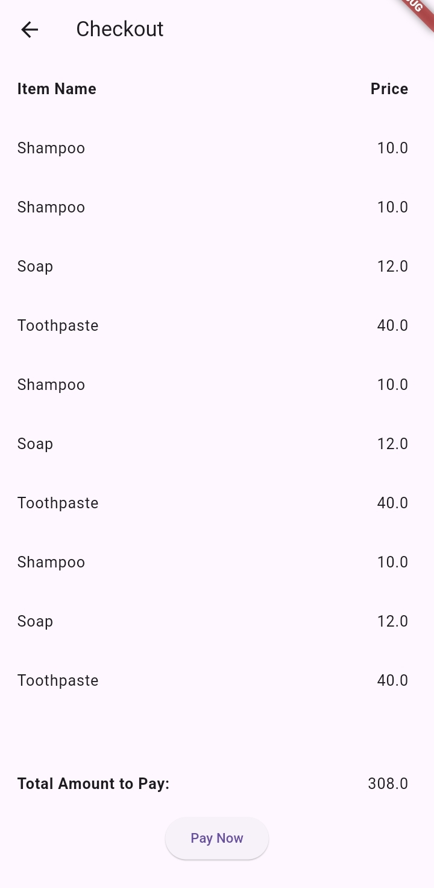
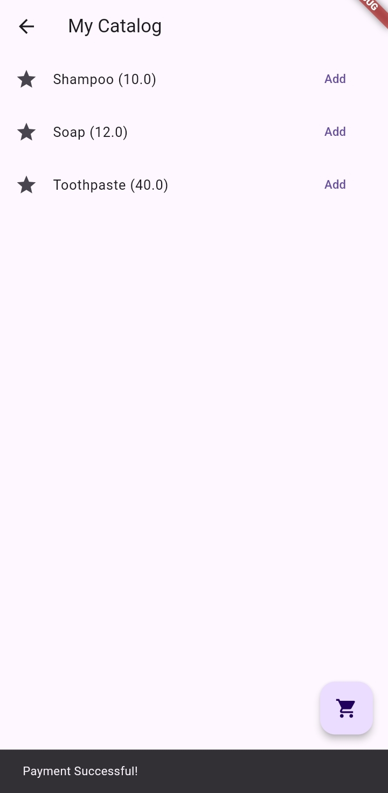

# exer-6-state-mgmt-mgdeocareza  
Name: Deocareza, Melisse G.  
Student Number: 2018-11709  
Section: UV5L  

Application Description:  
    Exercise 6  
    This application is a simple shopping app where a user can browse the product catalog, add items to cart, view items in the cart (scrollable list), and check out items from the cart.  

Application Screenshots:
     
    
    
    
    

Things I did in the code:  t5
    I applied State Management concepts in Flutter.  

Challenges when developing the application:  
    The main challenge is probably trying to take note all the details up to the smallest one in the exercise specifications and making sure nothing is overlooked. Fortunately, I was able to finish all of the requirements for the exercise correctly.